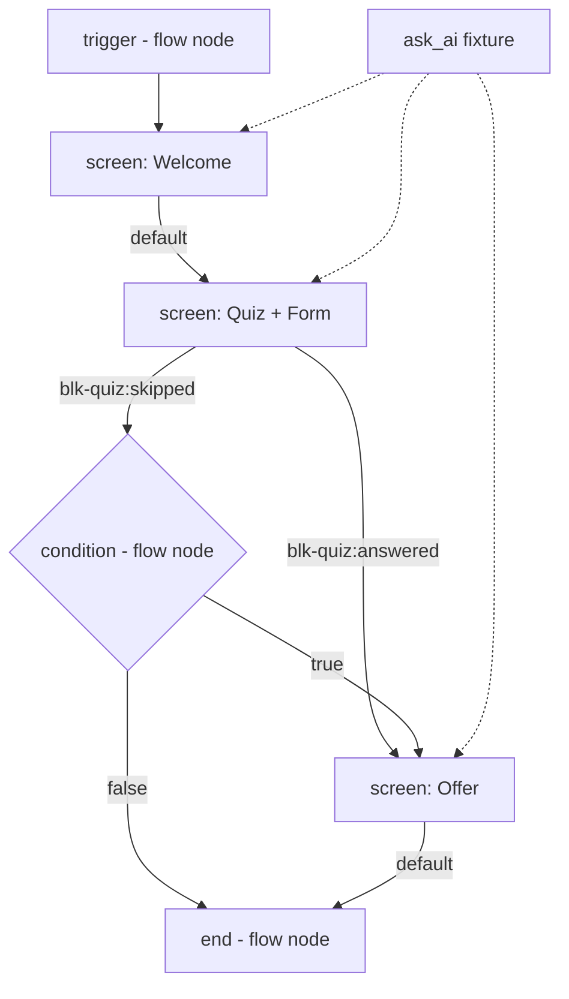

# PLAN — Multi-node Screens, Explicit Screen Advance, Persistent Ask-AI Chat

Target schema: `schemaVersion: 3`. No backward compatibility. Old graphs, seeds and DB rows are discarded.

---

## 0. Current state (verified)

| Concern | Today | File |
| --- | --- | --- |
| Graph shape | `{schemaVersion:2, theme, nodes[], edges[]}` | `frontend/src/lib/journeyGraph.ts:22` |
| Render unit | exactly one `LiveNode {id,type,config}` | `frontend/src/components/preview/LiveAdStage.tsx:219-226`, `LiveCard` `:278-327` |
| Device contract | `DeviceProps {config, style, theme, isActive, isFlashing, studio, onAdvance(handle?), onSelect}` | `frontend/src/nodes/_core/device.ts:2` |
| Advance model | per-node implicit; shared Continue/Back injected by `LiveCard` | `frontend/src/nodes/_core/nav.ts` |
| Nav/timeout config | validated orthogonally per node, never in a node's own schema | `_core/helpers.ts:10-13`, `_core/ConfigRouter.tsx:9,98-102` |
| WS frames out | `node`, `end`, `graph-stale`, `error`, `query_result` | `services/ai-service/app/sessions/protocol.py:49-88` |
| WS frames in | `start`, `choice`, `back`, `goto`, `timeout`, `restart`, `query` | same |
| Engine walk | node-by-node; `AUTO_TYPES={trigger,condition}` skipped, `FLOATING_TYPES={ask_ai}` detached | `services/ai-service/app/sessions/engine.py:1-3,193-221` |
| Ask-AI runtime | single `result: QueryResult|null`, `setResult(null)` on submit, state dies with the component | `frontend/src/components/preview/AskAiOverlay.tsx:16,23` |
| Java validation | `KEPT_TYPES` + per-type required fields + reachability + cycle | `services/journey-service/.../JourneyGraphValidator.java` |
| Persistence | `journeys.graph_json TEXT` | `infra/init-db.sh:29`, `.../entity/Journey.java:9` |

Confirmed pain points beyond the brief:

1. `container` never renders its children — it is a dashed placeholder (`nodes/container/Device.tsx:6`). It is the only "layout" primitive and it is inert.
2. `input`, `select`, `checkbox`, `rating` render live controls but are **uncontrolled and value-less** — none has an identifier field in its schema, so no answer can ever be collected.
3. `form` declares `fields[].required` but never enforces or renders it; `quiz` discards the selection and advances on click.
4. `countdown` renders a hardcoded `Continue` in every branch, unconditionally, conflicting with any shared CTA.
5. `trigger` renders a CTA that the runtime can never reach (engine auto-advances through `trigger`).
6. Several `defaultConfig` values fail their own schema (`condition.field:''`, `select.options:[]`, `quiz.options:[]`, `form.fields:[]`, `hero_section.headline:''`).

These are all fixed as a side effect of the screen model, and are folded into §8.

---

## 1. Data model

### 1.1 Decision

**Option (i): `screens[]` as a first-class ordered-children entity, with edges at screen level.**

Rejected alternatives and why:

- **(ii) layout `container`/`screen` *node* with children.** A screen would be simultaneously a graph vertex and a visual container — exactly the conflation that produced today's bug where `container` is a flow node that cannot contain anything. It also forces nested `config.children` arrays, which breaks the flat `nodes[]` pool that `patchNode`, `validateNodeConfig`, `bus('node:update')` and the style inspector all depend on.
- **(iii) `screenId` field on nodes.** Cheapest, but leaves *order* and *layout* homeless (you would need a parallel `screenOrder` map anyway) and makes edges ambiguous: if three nodes share a `screenId`, whose outgoing edges are the screen's exits? Grouping becomes derived state that any node edit can silently corrupt.

Option (i) makes the **screen the unit of navigation** — which is what the runtime and the session engine actually need — while keeping nodes a flat, individually-addressable pool.

### 1.2 Vertices

The edge graph connects **vertices**. A vertex is either:

- a **screen** (renderable, contains ordered blocks), or
- a **flow node** (`trigger`, `condition`, `end`) — not renderable, never inside a screen.

`ask_ai` is neither: it is a **fixture** attached to the journey and/or to individual screens (§5).



### 1.3 Schema (`frontend/src/lib/journeyGraph.ts`)

```ts
export interface ScreenLayout {
  mode: 'stack' | 'grid'
  direction: 'column' | 'row'
  gap: string
  padding: string
  align: 'start' | 'center' | 'end' | 'stretch'
  justify: 'start' | 'center' | 'end' | 'between' | 'around'
  columns?: number
  maxWidth?: string
  scroll: 'auto' | 'hidden' | 'paged'
}

export type AdvanceMode = 'button' | 'block' | 'auto' | 'none'

export interface ScreenAdvance {
  mode: AdvanceMode
  handle: string
  label: string
  position: 'bottom-sticky' | 'inline-end' | 'top'
  variant: 'solid' | 'outline' | 'ghost'
  fullWidth: boolean
  requireValid: boolean
  requireBlocks: string[]
  disabledHint?: string
  gesture?: 'none' | 'swipe-up' | 'tap-anywhere'
}

export interface ScreenBack { show: boolean; label: string }

export interface ScreenAskAi {
  enabled: boolean
  mode: 'floating' | 'inline'
  inlineIndex?: number
  pinPosition: 'top' | 'bottom'
}

export interface Screen {
  id: string
  name: string
  position: { x: number; y: number }
  size: { width: number; height: number }
  blocks: string[]
  layout: ScreenLayout
  theme?: Partial<ThemeConfig>
  style?: NodeStyle
  advance: ScreenAdvance
  back: ScreenBack
  timeoutSeconds?: number
  askAi?: ScreenAskAi
}

export interface JourneyGraph {
  schemaVersion: 3
  theme: ThemeConfig
  screens: Screen[]
  nodes: GraphNode[]
  edges: GraphEdge[]
  askAi: AskAiFixture | null
}
```

- `Screen.blocks: string[]` is the **single source of truth** for membership and order. Nodes do **not** carry `screenId`. A memoised `blockOwnerIndex(g): Map<nodeId, screenId>` is derived where needed.
- `Screen.size` + `Screen.position` are canvas-only (ReactFlow group geometry), analogous to today's `GraphNode.position`.
- Per-block visual tweaks (`order`, `gridColumn`, `flexGrow`, `maxWidth`, …) reuse the **existing** `node.config.style` (`_core/types.ts:48-71` already covers all of it). No new per-block layout schema.
- `Screen.theme` merges over `graph.theme`; `node.config.theme` is removed (§8) — per-node theme override was the wrong granularity and would fight the screen.

### 1.4 Edges

```ts
export interface GraphEdge {
  id: string
  source: string        // screenId | flowNodeId
  target: string        // screenId | flowNodeId
  sourceHandle?: string // 'default' | `${nodeId}:${handle}` | 'true' | 'false'
  label?: string
}
```

Screen exits, computed (never stored):

| Source | Handle | Emitted when |
| --- | --- | --- |
| Screen advance CTA | `screen.advance.handle` (default `'default'`) | `advance.mode ∈ {button, auto}` |
| Screen timeout | `screen.advance.handle` | `screen.timeoutSeconds > 0` |
| Block-owned exit | `${nodeId}:${handle}` | block has `blockOwnsExit`, per `registry[type].handles.outputs` |
| Flow node | `'default'` \| `'true'`/`'false'` | as today |

Blocks have **no handles on the canvas** — this is what removes edge ambiguity. A quiz inside a screen contributes exits `blk-q:answered` and `blk-q:skipped` rendered as *screen* handles, labelled `quiz · answered`.

### 1.5 Per-node "block meta"

Nav and timeout leave the node and go up to the screen. In their place, a third orthogonal schema joins `styleSchema` in `_core/types.ts`, validated by `validateNodeConfig` exactly as `nodeNavSchema`/`nodeTimeoutSchema` are today (`_core/helpers.ts:10-13`) and rendered by `ConfigRouter` for every non-flow type:

```ts
export const nodeBlockSchema = z.object({
  blockKey: z.string().regex(/^[a-zA-Z0-9_]{1,40}$/).optional(),
  blockRequired: z.boolean().optional(),
  blockOwnsExit: z.boolean().optional(),
  blockSpan: z.number().int().min(1).max(12).optional(),
  blockVisibleWhen: z.object({
    field: z.string().min(1),
    operator: z.enum(['eq','neq','contains','gt','lt','gte','lte']),
    value: z.any(),
  }).optional(),
})
```

- `blockKey` — payload key contributed on advance. **Required** for `input`, `select`, `checkbox`, `rating`; auto-seeded as `field_<4 hex>` on creation.
- `blockRequired` — participates in advance gating.
- `blockOwnsExit` — this block's own CTA is a screen exit (see the `mode:'block'` case).
- `blockVisibleWhen` — evaluated against the live screen values ⊕ session profile, so a screen can reveal a field conditionally without a graph branch.

### 1.6 Fate of the special types

| Type | New role |
| --- | --- |
| `trigger` | flow node, unchanged; its runtime CTA is deleted (unreachable today) |
| `condition` | flow node, unchanged; auto-advance, never rendered |
| `end` | flow node, terminal; stage-level "Journey complete" UI, `Device` kept studio-only |
| `ask_ai` | promoted out of `nodes[]` into `graph.askAi` fixture; may additionally be projected as an inline block inside a screen (§5) |
| `container` | **deleted** — `Screen.layout` supersedes it, and it never rendered children |

`AskAiFixture` (replaces the `ask_ai` graph node):

```ts
export interface AskAiFixture {
  id: string
  placeholder: string
  buttonLabel: string
  refusalMessage: string
  ragK: number
  allowJourneyJump: boolean
  allowRag: boolean
  answerStyle: 'thread' | 'single'
  persistence: 'session' | 'screen' | 'ephemeral'
  scope: 'global' | 'per-screen'
  pinnedPanel: boolean
  allowPin: boolean
  allowAdjust: boolean
  maxConcurrentQueries: number
  historyLimit: number
}
```

`answerStyle: 'single'` + `persistence: 'ephemeral'` reproduces today's behaviour exactly, so the existing mode stays available and is chosen at build time — satisfying "alongside current behaviour will be configured while building journey".

---

## 2. Editor UX

### 2.1 ReactFlow representation

`reactFlowNodeTypes` grows from one entry to three (`JourneyGraphEditor.tsx:24`):

```ts
const reactFlowNodeTypes = {
  screenNode: ScreenGroupRenderer,
  journeyNode: JourneyNodeRenderer,
  flowNode: FlowNodeRenderer,
}
```

`toFlow(g)` emits, in this order (parents must precede children in ReactFlow):

1. one `screenNode` per screen — `{ id, type:'screenNode', position: screen.position, style: {width,height}, data: {screen, exits, blockCount} }`
2. one `journeyNode` per block — `{ id: nodeId, type:'journeyNode', parentNode: screenId, extent:'parent', position: {x: 12, y: 44 + i*84}, draggable:true, data:{type, config, blockIndex} }`
3. one `flowNode` per `trigger`/`condition`/`end`

`fromFlow(nodes, edges, theme, screens)` reads `parentNode` for membership and **child `position.y` for order** — one source of truth in the flow layer, serialised into `screen.blocks`. This matches the existing round-trip pattern for `position`.

`ScreenGroupRenderer` renders: title bar (editable name, block count, advance-mode chip), a translucent body that ReactFlow fills with children, a `target` Handle on the left, and one labelled `source` Handle per computed exit stacked on the right. Resizing uses `NodeResizer`; if the pinned `reactflow@11.11.4` build does not export it, fall back to a corner drag-handle writing `screen.size` (risk R3).

### 2.2 Operations

| Op | Trigger | Behaviour |
| --- | --- | --- |
| Create screen | palette "Screen" item (pinned first), or drop any renderable node on empty canvas | new screen with `defaultScreen()`; a bare renderable node is **never** allowed to exist screen-less |
| Add block | drop palette item onto a screen body; or "＋ Add block" in the screen inspector | appends to `blocks`, seeds `blockKey` for value types |
| Group | multi-select ≥1 renderable node → toolbar **Group into screen** / `⌘G` | creates screen at the selection bbox; blocks ordered by current y; **all edges touching the grouped nodes are rewired to the screen** (dedup, drop self-edges) |
| Ungroup | screen selected → **Ungroup** / `⇧⌘G` | deletes screen + its edges; blocks each get their own single-block screen (keeps the invariant) |
| Reorder | drag child within group (y-order), or ↑/↓ in the inspector Blocks list | inspector list is the deterministic + keyboard-accessible path; drag is the fast path |
| Move between screens | drag child out of one group over another | `onNodeDragStop` + `getIntersectingNodes()` sets/clears `parentNode`; dropping on the pane re-wraps in a new screen |
| Resize | `NodeResizer` handles | writes `screen.size` |
| Delete screen | inspector Delete | deletes screen, its blocks, and its edges (confirm dialog, block count shown) |
| Reorder screens | canvas position only | screen order is edge-defined, not list-defined |

Drop-target affordance: while dragging a palette item, screens under the pointer get a dashed accent outline and an insertion caret between blocks.

### 2.3 Inspector

Right panel (`JourneyGraphEditor.tsx:518-561`) becomes context-driven:

- **Screen selected** → tabs `Layout` / `Advance` / `Blocks`
  - *Layout*: mode, direction, gap, padding, align, justify, columns, maxWidth, scroll, screen theme override, screen container style (reuses `StyleConfigRouter` widgets from `_core/styleWidgets.tsx`)
  - *Advance*: mode radio (`button`/`block`/`auto`/`none`), label, position, variant, fullWidth, gesture, `requireValid`, `requireBlocks` multi-select (only blocks with a `blockKey`), `disabledHint`, back toggle + label, `timeoutSeconds` (the old `TimeoutSection`, relocated)
  - *Blocks*: ordered list with ↑/↓/⧉/🗑, type chip, `blockKey` chip, required chip, validation dot; click selects the block
- **Block selected** → owner-screen breadcrumb (click to select screen) + `Block` section (`blockKey`, required, ownsExit, span, visibleWhen) + the existing per-type `JourneyConfig`
- **Flow node selected** → existing `JourneyConfig`, no block/advance/timeout sections
- **Ask-AI fixture selected** → the `AskAiFixture` form (§5.6), reachable from a permanent canvas chip rather than a graph node

### 2.4 Validation (`frontend/src/lib/validation.ts` + Java mirror)

New rules:

| Rule | Severity |
| --- | --- |
| screen has 0 blocks | error |
| renderable node in 0 screens | error |
| renderable node in ≥2 screens | error |
| flow node (`trigger`/`condition`/`end`) listed in `screen.blocks` | error |
| `screen.blocks` references a missing node | error |
| `advance.mode==='button'` and screen has 0 outgoing edges | error |
| `advance.mode==='block'` and no block has `blockOwnsExit` | error |
| `advance.mode==='none'` and screen has outgoing edges | warning |
| `requireBlocks` entry not in `blocks`, or block has no `blockKey` | error |
| duplicate `blockKey` within a screen | error |
| value-type block (`input`/`select`/`checkbox`/`rating`) without `blockKey` | error |
| `blockVisibleWhen.field` matches no `blockKey` in the screen and no profile key written upstream | warning |
| edge `sourceHandle` is `nodeId:handle` where `nodeId ∉ source screen.blocks` | error |
| screen unreachable from `trigger` | error (suppressed while the graph is a draft, as today at `:334`) |
| `graph.askAi.scope==='per-screen'` but no screen sets `askAi.enabled` | warning |

Existing rules kept: exactly one `trigger`; reachability BFS (now over vertices); branch-capable exits must be labelled; cycle detection.

### 2.5 Selection sync

Extend `frontend/src/lib/events.ts`:

```ts
'screen:select': { screenId: string | null; source: 'canvas' | 'device' | 'toolbar' }
'screen:update': { screenId: string; patch: Partial<Screen> }
'block:reorder': { screenId: string; blocks: string[] }
```

`node:select` keeps its meaning — *a block is selected* — and the canvas additionally emits `screen:select` for the owner. Runtime side (`LiveAdStage.tsx:179-197`):

- inbound `node:select` from canvas → resolve owner screen from the fetched graph index; if owner ≠ current screen, `sendGoto({nodeId})` (the backend resolves node→screen, §3.4); else flash that block
- inbound `screen:select` from canvas → `sendGoto({screenId})`
- on screen change in studio, emit `screen:select {source:'device'}` and `node:select` for the first block

---

## 3. Runtime protocol

Hard break. `node` frame is deleted, `screen` frame replaces it.

### 3.1 Server → client

```ts
interface LiveBlock { nodeId: string; type: string; config: any }

interface LiveScreenMeta {
  id: string
  name: string
  layout: ScreenLayout
  theme: ThemeConfig            // already merged graph ⊕ screen, server-side
  style?: NodeStyle
  advance: ScreenAdvance
  back: ScreenBack
  askAi?: ScreenAskAi
}

interface LiveChoice {
  handle: string
  label: string
  source: 'advance' | 'block' | 'timeout'
  blockId?: string
}
```

```python
class ScreenFrame(BaseModel):
    type: Literal['screen'] = 'screen'
    sessionId: str
    graphVersion: int
    stepIndex: int
    screen: dict
    blocks: list[dict]
    choices: list[ChoiceOption]
    timeoutMs: Optional[int] = None
```

`LiveState` (`frontend/src/lib/liveSession.ts:52-57`):

```ts
export type LiveState =
  | { status: 'connecting' }
  | { status: 'screen'; sessionId: string; graphVersion: number; stepIndex: number;
      screen: LiveScreenMeta; blocks: LiveBlock[]; choices: LiveChoice[]; timeoutMs: number | null }
  | { status: 'ended'; sessionId: string; reason: string }
  | { status: 'stale'; serverVersion: number }
  | { status: 'error'; code: string; message: string }
```

New frame `chat_history` (§5.4). `query_result` gains `queryId`.

### 3.2 Client → server

| Frame | Change |
| --- | --- |
| `start` | unchanged |
| `choice` | `{type:'choice', handle, payload}` — `payload` is now **always** the aggregated screen answer map, merged with any block-local extras |
| `back` | unchanged; history is screen-level |
| `goto` | `{type:'goto', screenId?, nodeId?}` — exactly one required; `nodeId` resolves to its owning screen server-side |
| `timeout` | `{type:'timeout', stepIndex, screenId}` (was `nodeId`) |
| `restart` | unchanged |
| `query` | `{type:'query', queryId, query, screenId?, blockId?}` |

### 3.3 Choice aggregation

`engine.screen_exits(graph, screen)`:

1. If `advance.mode ∈ {button, auto}` → candidate `advance.handle`.
2. For each `nodeId ∈ screen.blocks` where `config.blockOwnsExit` is true → candidates `f"{nodeId}:{h}"` for each `h` in `registry_handles(type)` (`condition`→`true/false` never applies; `quiz`→`answered/skipped`; `video`→`watched/skipped`; everything else → `default`).
3. Intersect candidates with `outgoing(graph, screen.id)` matched on `sourceHandle`, so the author only ever sees exits that are actually wired.
4. Label = `edge.label` or `human_label(handle)`; `source` = `advance` | `block`; `blockId` set for block exits.

Semantics preserved from today:

- **`timeoutMs`** is emitted only when `len(choices) <= 1` (mirrors `sessions.py:115` and `liveSession.ts:95`). Source moves from `node.config.timeoutSeconds` to `screen.timeoutSeconds`.
- **`stepIndex`** still increments once per vertex transition — now coarser (one screen = one step) which is exactly the fix: a 5-block screen is one step, not five.
- **`graphVersion`** unchanged; `graph-stale` → reconnect. The `pendingGotoNodeId` resume path (`liveSession.ts:122-128,136-141`) becomes `pendingResume: {screenId}`.
- **`back`** pops screen-level history. Answers for the popped screen are retained in `sess["profile"]` and replayed into the form so Back → Forward does not lose typing (new: `ScreenFrame` blocks carry no values; the client keeps a `Map<screenId, values>` for the session).
- **`restart`** clears profile, history, step index — and (new) the per-screen value cache, but **not** the Ask-AI thread unless `persistence !== 'session'`.

### 3.4 Engine changes (`services/ai-service/app/sessions/engine.py`)

```
vertex_index(graph)      -> {id: {'kind':'screen'|'flow', ...}}
block_owner(graph)       -> {nodeId: screenId}
entry_vertex(graph)      -> trigger, else first screen
screen_payload(screen, theme) -> merged-theme screen meta dict
block_payload(node)      -> {nodeId, type, config}
screen_exits(graph, screen)   -> [choice dicts]
screen_timeout_ms(screen)     -> int | None
step(...)                -> ('screen', screen, blocks, choices) | ('end', reason)
apply_choice(...)        -> merges payload into profile, matches edge by handle
jump_to(...)             -> BFS over vertices; nodeId args resolved via block_owner
```

Deleted: `node_timeout_ms`, `find_ask_ai_node`, `ask_ai_config`'s node lookup (reads `graph['askAi']` now), the `FLOATING_TYPES` branch in `jump_to` (`engine.py:166-170`) and the `goto-floating` branch in `sessions.py:219-221` — `ask_ai` is no longer a vertex, so neither can be reached.

`persist_mod.save_execution` signature changes from `(sessionId, nodeId, nodeType, handle, profile)` to `(sessionId, screenId, blockIds, handle, profile)`; the `journey_executions` table gains `screen_id` and `block_ids` and drops `node_id`/`node_type`.

---

## 4. Rendering

### 4.1 Component tree

```
LiveAdStage                       (session, framing, overlay patch, studio wiring)
├── FramedScreen                  (unchanged; react-device-bezels / mac / desktop chrome)
├── ScreenRenderer                (NEW — replaces LiveCard)
│   ├── PinnedAnswers             (NEW — Ask-AI pinned/adjusted text, on-screen)
│   ├── TimeoutCountdown          (moved inside; keyed by screenId)
│   ├── BlockRenderer × N         (NEW — getDevice(block.type))
│   ├── AskAiInline               (NEW — when screen.askAi.mode === 'inline')
│   └── ScreenAdvanceBar          (NEW — shared CTA + Back, sticky)
└── AskAiOverlay                  (rewritten — thread view over the store)
```

`LiveCard` (`LiveAdStage.tsx:278-327`) is deleted.

### 4.2 `ScreenRenderer`

```ts
interface ScreenRendererProps {
  client: LiveSessionClient
  screen: LiveScreenMeta
  blocks: LiveBlock[]
  choices: LiveChoice[]
  layout: AdLayoutTokens
  studio?: boolean
  selectedBlockId?: string | null
  flashingBlockId?: string | null
  onSelectBlock?: (id: string | null) => void
}
```

Container style, composed in this precedence order:

1. `adLayoutFor(viewportId)` tokens — `stagePadding`, `contentMaxWidth`, `cardPadding` (`lib/viewports.ts:23-27`)
2. `screen.layout` → `display:flex|grid`, `flexDirection`, `gap`, `padding`, `alignItems`, `justifyContent`, `gridTemplateColumns: repeat(columns, minmax(0,1fr))`, `maxWidth`
3. `applyStyle(screen.style)` (`_core/preview.ts:13`)

`lib/viewports.ts` gains screen-aware tokens so a multi-block screen has room to breathe:

```ts
export interface AdLayoutTokens {
  stagePadding: number
  contentMaxWidth: number
  cardPadding: number
  blockGap: number         // NEW  mobile 12 / tablet 16 / desktop 20
  advanceBarHeight: number // NEW  mobile 56 / tablet 64 / desktop 64
}
```

### 4.3 `BlockRenderer` and the `DeviceProps` change

```ts
export interface DeviceProps<C = any> {
  config: C
  style: NodeStyle
  theme: ThemeConfig
  blockId: string
  value?: any
  error?: string | null
  onChange?: (value: any) => void
  onAdvance: (handle?: string, payload?: any) => void
  isActive?: boolean
  isFlashing?: boolean
  studio?: boolean
  onSelect?: () => void
}
```

- `value`/`onChange` make value-bearing devices **controlled** — the fix for finding (2). `BlockRenderer` wires them to `useScreenForm`.
- `onAdvance(handle, payload)` from a block namespaces to `${blockId}:${handle ?? 'default'}` and merges `payload` into the collected form values before `client.sendChoice`.
- `blockVisibleWhen` is evaluated in `BlockRenderer`; hidden blocks render nothing and are excluded from gating.
- In studio, each block gets its own outline / `Selected` chip / flash ring (today these live on the single `LiveCard`, `:290-299`). Click → `bus.emit('node:select', {nodeId: blockId, source:'device'})`, `stopPropagation` so it does not also select the screen.

### 4.4 `useScreenForm`

```ts
function useScreenForm(screenId: string, blocks: LiveBlock[], advance: ScreenAdvance): {
  values: Record<string, any>
  errors: Record<string, string>
  touched: Record<string, boolean>
  setValue: (key: string, v: any) => void
  isValid: boolean
  missing: string[]
  collect: () => Record<string, any>
}
```

- Seeded from block config defaults (`checkbox.checked`, `rating.value`, `select` first option when `blockRequired`).
- Keyed by `screenId`; a module-level `Map<screenId, values>` restores answers on Back/Forward within a session.
- `isValid` = every visible block with `blockRequired` (plus every `advance.requireBlocks` entry) has a non-empty value, **and** every visible `form` block passes its own `fields[].required` — the fix for finding (3).

### 4.5 `ScreenAdvanceBar`

- Rendered only when `advance.mode === 'button'` or `back.show`.
- `position: sticky; bottom: 0` inside the scroll container, with a surface-coloured backdrop and top hairline. Sticky (not fixed) because the device frames apply `transform: scale()` (`LiveAdStage.tsx:55,69,82`) and `position: fixed` would escape the transformed container.
- Disabled when `advance.requireValid && !isValid`; shows `disabledHint` or `Complete: <missing labels>` via a tooltip and `aria-describedby`.
- Click → `client.sendChoice(advance.handle, collect())`.
- `advance.gesture === 'swipe-up'` adds a touch handler on the scroll container; `'tap-anywhere'` adds a full-bleed click layer behind the blocks. Both are additive to the button, never a replacement (accessibility).
- `advance.mode === 'block'` renders no bar; blocks that own an exit render their own CTA. `advance.mode === 'auto'` renders no bar, only `TimeoutCountdown`.

### 4.6 Scroll and viewport

- `overflow-y: auto` on the screen container inside `FramedScreen`, with `padding-bottom: advanceBarHeight` so the last block clears the sticky bar.
- `layout.scroll: 'hidden'` → clip and let the author own the fit; `'paged'` → `scroll-snap-type: y mandatory` with each block a snap point.
- `layout.scroll: 'auto'` + a tall screen shows a subtle bottom scroll-shadow so a below-the-fold CTA is discoverable.
- Studio-selecting an off-screen block scrolls it into view (`scrollIntoView({block:'center'})`) before flashing.

---

## 5. Ask-AI persistence

### 5.1 Thread model

```ts
export type ChatRole = 'user' | 'assistant'
export type ChatStatus = 'pending' | 'done' | 'error'

export interface ChatMessage {
  id: string
  queryId: string
  role: ChatRole
  text: string
  editedText?: string
  result?: QueryResult
  targetNodeId?: string
  screenId?: string
  sessionId: string
  ts: number
  status: ChatStatus
  error?: string
  pinned?: boolean
}

export interface ChatThread {
  key: string
  messages: ChatMessage[]
  unread: number
  open: boolean
  updatedAt: number
}
```

Answers are **appended**, never replaced. `pinned` messages additionally render on the screen itself.

### 5.2 Where it lives

New module `frontend/src/lib/askAiThread.ts` — a **zustand** store (already a dependency) living **outside** the React tree, so it survives `AskAiOverlay` unmount, screen change, and `LiveAdStage` remount.

```ts
threadKey = `${mode}|${campaignId ?? ''}|${journeyId ?? ''}`
```

Keyed by `threadKey`, **not** `sessionId` — because `graph-stale` reconnects mint a new `sessionId` (`sessions.py:169`) and the thread must survive that. Each message records its own `sessionId` for trace.

Mirrored to `sessionStorage` under `journeo.askai.<threadKey>` (debounced 300ms, capped at `historyLimit` messages, oldest evicted). `sessionStorage` — not `localStorage` — so a thread is per-tab and does not leak across campaigns or browser sessions. Hydrated synchronously on first store access.

Three storage tiers:

| Tier | Purpose | Phase |
| --- | --- | --- |
| zustand store | live state, survives unmount + screen change | 4 |
| `sessionStorage` | survives page reload and `graph-stale` reconnect within the tab | 4 |
| backend `sess["chat"]` + `chat_history` frame | survives a genuinely new tab / shared-session replay; feeds analytics | 5 (optional) |

Backend tier: `sessions.py` appends `{queryId, query, decision, answer, ts, screenId}` to `sess["chat"]` (already persisted per-query via `save_activity 'node:query'` at `:248`) and emits a `chat_history` frame right after the first `screen` frame when the client sends `start` with a `resumeThread: true` hint.

### 5.3 Scope: global vs per-screen

| `fixture.scope` | Behaviour |
| --- | --- |
| `'global'` | one thread for the journey; the floating launcher is present on every screen |
| `'per-screen'` | the launcher/inline widget appears only where `screen.askAi.enabled`; the **thread is still one thread** (messages tagged with `screenId`), so history is continuous even though the entry point is not |

| `fixture.persistence` | On screen change | On new query |
| --- | --- | --- |
| `'session'` (default) | keep, append, insert a `— Screen: <name> —` separator | append |
| `'screen'` | drop messages whose `screenId ≠ current` | append |
| `'ephemeral'` | keep only the newest exchange | **replace** (today's behaviour) |

`fixture.answerStyle: 'single'` forces the render to show only the newest assistant message regardless of what the store holds — so an author can pick "one clean answer" UX without losing the trace.

### 5.4 Pin / adjust spec

- **Pin** — `allowPin` gates a pin affordance on every `role:'assistant'` message. Pinning sets `pinned:true`; `PinnedAnswers` (rendered by `ScreenRenderer`, at `screen.askAi.pinPosition`) shows all pinned messages as compact cards with an unpin ✕. Because `PinnedAnswers` is part of the screen and the store is global, **pinned/adjusted text stays visible after the chat is collapsed and after the screen changes** — the (a) requirement.
- **Adjust** — `allowAdjust` gates inline editing of an assistant message. The edit writes `editedText`; every render prefers `editedText ?? text`; `text` is retained for the trace. An adjusted message is auto-pinned (an author adjusts text *because* they want to keep it).
- Pin cap: 5 per screen; pinning a 6th evicts the oldest with a toast.
- Pinned cards inherit the merged screen theme, so a pinned answer never looks foreign on a re-themed screen.
- A `decision:'jump'` message is pinnable too; its card keeps the `targetNodeDetails` title/subtitle/facts rendering that exists today (`AskAiOverlay.tsx:68-83`) and gains a "Go there" button → `client.sendGoto({nodeId: targetNodeId})`.

### 5.5 History UI

- Scrollback, oldest → newest, auto-scroll to bottom **unless** the user has scrolled up ≥40px (then show a "↓ new answer" pill).
- `— Screen: <name> —` separator whenever consecutive messages differ in `screenId`.
- Per-message: role avatar, timestamp on hover, `decision` chip (`journey` / `knowledge` / `out of context`), citations collapsed behind "N sources".
- Header: title, unread badge, `Collapse` chevron, `Clear` (confirm → clears store + `sessionStorage` for that `threadKey`), `Pin count` chip.
- Collapsed state = today's floating launcher button (`AskAiOverlay.tsx:33-44`) with an unread count badge; `open` is stored in the thread so it survives screen changes.
- `pending` messages render a skeleton bubble with a spinner; `error` messages render the error plus a `Retry` that re-sends the same text as a **new** message (the failed one stays, greyed).
- Height: `max-height: min(60vh, 420px)`, `overflow-y:auto`, `overscroll-behavior: contain` so scrolling the thread never scrolls the screen behind it.

### 5.6 `sendQuery` concurrency and timeout

Today one `queryPending` slot; a second query rejects the first (`liveSession.ts:197-200`) — which is why answers vanish.

New:

```ts
private queryPending = new Map<string, { resolve; reject; timer: number }>()

sendQuery(query: string, opts?: { screenId?: string; blockId?: string; timeoutMs?: number }): { queryId: string; promise: Promise<QueryResult> }
```

- Each query gets a `queryId` (`crypto.randomUUID()`); `query_result` echoes it and is routed to the matching slot. No query can cancel another.
- Per-query timeout (default 60s, configurable) marks **only that** message `status:'error'`.
- `fixture.maxConcurrentQueries` (default 3): beyond that, `submit()` queues locally and the input shows "waiting…"; the thread still accepts typing.
- Socket close / `error` frame rejects all pending slots and marks those messages `error`.
- Jump race: a `jump` result whose `screenId` no longer matches the current screen does **not** auto-navigate; it renders a "Go there" affordance instead. Server-side, the auto-jump at `sessions.py:250-254` becomes conditional on the request's `screenId` still equalling `sess["current_id"]`, so a stale query can never yank the user off a screen they have since advanced past.

---

## 6. Migration — exact deletions

Compatibility is not required. Delete, do not deprecate.

### 6.1 Frontend files deleted

| Path | Reason |
| --- | --- |
| `frontend/src/nodes/_core/nav.ts` | superseded by `_core/screen.ts` (`screenExits`, `advanceLabel`, `backLabel`, `blockOwnsExit`) |
| `frontend/src/nodes/container/index.ts` | `Screen.layout` supersedes it; it never rendered children |
| `frontend/src/nodes/container/schema.ts` | ditto |
| `frontend/src/nodes/container/Device.tsx` | ditto |
| `frontend/src/nodes/container/JourneyConfig.tsx` | ditto |
| `frontend/src/nodes/container/StyleConfig.tsx` | ditto |
| `frontend/src/nodes/_core/prune.ts` | dead v1→v2 type migration; no back-compat |

### 6.2 Frontend symbols deleted

| Symbol | File |
| --- | --- |
| `nodeNavSchema`, `NodeNav` | `_core/types.ts:94-100` |
| `nodeTimeoutSchema`, `NodeTimeout` | `_core/types.ts:90-93` (constant `MAX_TIMEOUT_SECONDS` moves to the screen schema) |
| `NavButtonsSection` | `_core/ConfigRouter.tsx:47-92` |
| `TimeoutSection` | `_core/ConfigRouter.tsx:11-45` (logic relocated into the screen Advance tab) |
| `NO_TIMEOUT_TYPES` | `_core/ConfigRouter.tsx:9` |
| nav/timeout `safeParse` passes | `_core/helpers.ts:10-13` (replaced by a `nodeBlockSchema` pass) |
| `migratePrunedType` import + call | `lib/journeyGraph.ts:3,56` |
| legacy `nodeStyles` / `nodeOverrides` hoisting | `lib/journeyGraph.ts:52-61` |
| `effectiveTheme` | `lib/journeyGraph.ts:162-171` (per-node theme override removed; screen theme replaces it) |
| `LiveCard` | `components/preview/LiveAdStage.tsx:278-327` |
| `LiveNode` | `lib/liveSession.ts:46-50` → `LiveBlock` |
| `LiveState` variant `'node'` | `lib/liveSession.ts:54` → `'screen'` |
| `pendingGotoNodeId` | `lib/liveSession.ts:71` → `pendingResume` |
| single `queryPending` slot | `lib/liveSession.ts:70,197-207` → `Map` |
| `result` state + `setResult(null)` | `components/preview/AskAiOverlay.tsx:16,23` |
| `FLOATING_NODE_TYPES` | `components/nodes/JourneyNodeRenderer.tsx:53` (ask_ai is no longer a graph node) |
| `askAiConfig` prop drilling + journey re-fetch | `LiveAdStage.tsx:90,147-165`; `FloatingDevicePreview.tsx`; `CampaignSetup.tsx:707` — the fixture arrives on the `screen` frame |
| `ICONS.container`, `Preview` case `'container'` | `JourneyNodeRenderer.tsx:22,85-86` |
| `branchCapableNodeTypes` | `_core/registry.ts:81` → derived from `handles.outputs.length > 1` |

### 6.3 Backend deleted

| Symbol | File |
| --- | --- |
| `NodeFrame` | `services/ai-service/app/sessions/protocol.py:49-56` → `ScreenFrame` |
| `node_payload` | `.../routers/sessions.py:99-103` → `screen_payload` + `block_payload` |
| `node_timeout_ms` | `.../sessions/engine.py:8-25` → `screen_timeout_ms` |
| `find_ask_ai_node` | `.../sessions/engine.py:237-241` (fixture is `graph['askAi']`) |
| `FLOATING_TYPES` + its `jump_to` branch | `.../sessions/engine.py:3,166-170` |
| `goto-floating` branch | `.../routers/sessions.py:219-221` |
| `AUTO_TYPES` | `.../sessions/engine.py:1` (unused; `step()` already special-cases by type) |
| `TimeoutMessage.nodeId` | `.../sessions/protocol.py:22` → `screenId` |
| `PRUNED_MAP` | `.../JourneyGraphValidator.java:11-23` |
| `"container"` in `KEPT_TYPES` | `.../JourneyGraphValidator.java:9` |
| `BRANCH_TYPES` single-implicit-edge rule | `.../JourneyGraphValidator.java:10,73` → re-expressed as a screen-exit rule |

### 6.4 Data

- `JourneyGraphValidator.validate` rejects any graph whose `schemaVersion != 3` with `{"nodeId":"graph","field":"schemaVersion","message":"Unsupported graph schema, rebuild the journey"}`.
- `GraphSerializer.serialize` requires `screens`, `nodes`, `edges` arrays (currently only `nodes`/`edges`, `GraphSerializer.java:12-13`).
- `GraphSerializer.stripStyle` must also strip `screens[].style` and `screens[].theme` so screen restyling stays a style-only diff and does not invalidate live sessions (`isStyleOnlyDiff` gates `notifyGraphChanged` at `CampaignController.java:72`).
- New `infra/reset-journeys.sql`: `TRUNCATE journeys, journey_executions, sessions CASCADE;` — existing rows are unreadable and there is no upgrade path by design.
- `journey_executions` gains `screen_id VARCHAR`, `block_ids TEXT`; drops `node_id`, `node_type`.

### 6.5 Tests rewritten or deleted

| Path | Action |
| --- | --- |
| `frontend/src/lib/journeyGraph.test.ts` | rewrite for v3; delete legacy `nodeStyles`/`nodeOverrides` cases |
| `frontend/src/components/journey/JourneyGraphEditor.test.tsx` | rewrite — `ask_ai` singleton cases become fixture cases; palette double-click now creates a screen wrapper |
| `frontend/src/pages/CampaignSetup.test.tsx` | update the fake backend graph fixtures to v3; assertions on `graph.nodes.length` become `graph.screens[0].blocks.length` |
| `frontend/src/hooks/useCampaignJourney.test.ts` | update inline graph JSON fixtures to v3 |
| `services/ai-service/tests/test_session_engine.py` | rewrite for screen vertices |
| `services/ai-service/tests/test_query_resolve.py` | `graph()`/`apple_graph()` fixtures become v3; `test_floating_node_never_jumped` re-expressed against the fixture |
| `services/journey-service/src/test/.../GraphSerializerTest.java` | add `screens` to the valid-graph fixture; add a missing-`screens` rejection case |

---

## 7. Phased implementation

### Phase 0 — Schema and pure logic (no UI)

Files: `frontend/src/lib/journeyGraph.ts`, new `frontend/src/lib/screen.ts`, `frontend/src/nodes/_core/types.ts`, `frontend/src/nodes/_core/helpers.ts`, `frontend/src/lib/validation.ts`, delete `_core/nav.ts` + `_core/prune.ts`.

- v3 interfaces, `emptyGraph`, `parseGraph`, `serializeGraph`, `toFlow`, `fromFlow`, `patchNode`, new `patchScreen`, `addScreen`, `removeScreen`, `groupIntoScreen`, `ungroupScreen`, `moveBlock`, `reorderBlocks`, `blockOwnerIndex`, `mergedScreenTheme`.
- `screen.ts`: `screenExits`, `advanceLabel`, `backLabel`, `blockOwnsExit`, `isRenderableType`, `isFlowType`, `isValueType`, `defaultScreen`, `defaultAdvance`, `defaultLayout`, `evalVisibleWhen`, `collectPayload`.
- `nodeBlockSchema`; delete nav/timeout schemas.
- All new validation rules.

Gate: `npm run test` green on the rewritten `journeyGraph.test.ts` + a new `screen.test.ts`.

### Phase 1 — Backend

Files: `services/ai-service/app/sessions/protocol.py`, `engine.py`, `persistence.py`, `app/routers/sessions.py`, `app/sessions/spring.py`, `app/graphs/subflows/query_resolve_subflow.py`.

- `ScreenFrame`, `TimeoutMessage.screenId`, `GotoMessage.screenId|nodeId`, `QueryMessage.queryId|screenId|blockId`, `QueryResultFrame.queryId`, `ChatHistoryFrame`.
- `spring.parse_graph` returns `{screens, nodes, edges, theme, askAi}`.
- Engine rewrite per §3.4.
- `summarize_graph` / `node_details` walk `screens[].blocks` → node lookup, and tag each summary with its `screenId` so an Ask-AI jump targets a *screen* (`query_resolve_subflow.py:13-47`). The ask_ai-skip at `:19-20` is deleted (ask_ai is no longer in `nodes`).
- Query auto-jump guarded by a screen-freshness check.

Gate: `pytest services/ai-service/tests` green.

### Phase 2 — Runtime rendering

Files: `frontend/src/lib/liveSession.ts`, `components/preview/LiveAdStage.tsx`, new `components/preview/ScreenRenderer.tsx`, `BlockRenderer.tsx`, `ScreenAdvanceBar.tsx`, `useScreenForm.ts`, `PinnedAnswers.tsx`; `nodes/_core/device.ts`; **all 21 remaining** `nodes/*/Device.tsx`; `lib/viewports.ts`.

Order: `device.ts` contract → `useScreenForm` → `BlockRenderer` → `ScreenRenderer` + `ScreenAdvanceBar` → `LiveAdStage` swap → per-node Device updates (§8).

Gate: a multi-block screen renders headline + image + text + input + shared CTA in `FloatingDevicePreview` at all four viewports.

### Phase 3 — Editor

Files: `components/journey/JourneyGraphEditor.tsx`, new `components/journey/ScreenGroupRenderer.tsx`, `ScreenInspector.tsx`, `BlocksList.tsx`, `FlowNodeRenderer.tsx`, `AskAiFixturePanel.tsx`; `components/nodes/JourneyNodeRenderer.tsx`; `lib/events.ts`; `nodes/_core/ConfigRouter.tsx`; `nodes/_core/registry.ts`.

- Three ReactFlow node types, group geometry, resize.
- `⌘G` / `⇧⌘G`, drag-into-group, inspector tabs, validation surfacing per screen and per block.
- `screen:select` / `screen:update` / `block:reorder` events + `LiveAdStage` handlers.

Gate: rewritten `JourneyGraphEditor.test.tsx` green; group/ungroup/reorder round-trip through `fromFlow`→`toFlow` is stable.

### Phase 4 — Ask-AI thread

Files: new `lib/askAiThread.ts`; `components/preview/AskAiOverlay.tsx` (rewrite); new `components/preview/AskAiThread.tsx`, `AskAiInline.tsx`; `components/preview/PinnedAnswers.tsx`; `lib/liveSession.ts` (`queryId` map); `nodes/ask_ai/schema.ts` + `JourneyConfig.tsx` + `Device.tsx`.

Gate: thread survives 3 screen advances, a `graph-stale` reconnect, and an `AskAiOverlay` unmount/remount; two concurrent queries both resolve.

### Phase 5 — Cleanup and hardening

Files: `services/journey-service/.../JourneyGraphValidator.java`, `GraphSerializer.java`, `infra/reset-journeys.sql`, `infra/init-db.sh`, `pages/CampaignSetup.tsx`, `pages/JourneyCanvas.tsx`, `pages/PublicCampaign.tsx`, `components/preview/FloatingDevicePreview.tsx`, all remaining test fixtures, storybook stories.

- Java validator mirrors §2.4 exactly (drift between the TS and Java validators is the top long-term risk).
- Fix the six `defaultConfig`-fails-own-schema bugs (finding 6).
- Remove `askAiConfig` prop drilling from the three pages + `FloatingDevicePreview`.

### 7.1 Risks

| # | Risk | Mitigation |
| --- | --- | --- |
| R1 | **Two validators drift** (TS `validation.ts` vs Java `JourneyGraphValidator`) — already true today, worse with screens | extract the rule list into a shared JSON fixture (`infra/graph-rules.json`) and add a test on both sides that asserts rule-id parity; publish once, assert twice |
| R2 | Block order has two representations (child `position.y` on canvas, `blocks[]` in the graph) | `fromFlow` is the only writer of `blocks[]`; add a round-trip property test (`toFlow ∘ fromFlow ≡ identity` on order) and never mutate `blocks[]` directly outside the documented ops |
| R3 | `NodeResizer` comes from `@reactflow/node-resizer`, re-exported by the `reactflow` umbrella in v11 and needing its own stylesheet import — unverified against the pinned `11.11.4` because `node_modules` is not populated in this checkout | verify in Phase 3 hour 1 (`import { NodeResizer } from 'reactflow'` + `@reactflow/node-resizer/dist/style.css`); fallback is a 16px corner drag-handle writing `screen.size` — isolated to `ScreenGroupRenderer` either way |
| R4 | Sticky advance bar inside `transform: scale()` device frames | `position: sticky` (works under transforms) not `fixed`; explicit test at zoom 0.4 / 0.5 / 1.0 on all three frame kinds |
| R5 | Studio `goto` churn — dragging a block emits `node:select` per frame → `sendGoto` storm | debounce `sendGoto` 200ms, and suppress `node:select`→`goto` while `onNodeDrag` is active |
| R6 | Ask-AI jump race pulls the user off a screen they already left | client-side "Go there" affordance instead of auto-nav; server-side screen-freshness guard before `jump_to` |
| R7 | `sessionStorage` quota with long threads / large `targetNodeDetails` | `historyLimit` (default 100) with oldest-first eviction; strip `citations[].snippet` beyond 200 chars before persisting |
| R8 | `graph-stale` reconnect loses screen position | `pendingResume: {screenId}` replaces `pendingGotoNodeId`; test-mode only, as today |
| R9 | A screen with 8 blocks on a 390×844 viewport is unusable | `layout.scroll:'auto'` + scroll shadow + sticky CTA; editor warning at >6 blocks on a mobile-first journey |
| R10 | Grouping rewires edges wrongly when a selection spans a branch | `groupIntoScreen` refuses a selection containing a flow node, dedups rewired edges, drops self-edges, and shows a diff preview before committing |
| R11 | Ungroup produces N single-block screens and a broken flow | ungroup chains the promoted screens in their previous block order and rewires in→first, last→out |

### 7.2 Test plan

**Unit — `frontend/src/lib`**

- `screen.test.ts`: `screenExits` for all four advance modes × wired/unwired edges; `blockOwnsExit` precedence; `evalVisibleWhen` for all 7 operators; `collectPayload` merges block-local payload over form values.
- `journeyGraph.test.ts`: v3 parse/serialize round-trip; `parseGraph` on garbage; `groupIntoScreen` edge rewiring (incl. R10 cases); `ungroupScreen` chaining (R11); `reorderBlocks`; `toFlow ∘ fromFlow` order identity (R2); `mergedScreenTheme` precedence graph→screen.
- `validation.test.ts`: one case per rule in §2.4, positive and negative.
- `askAiThread.test.ts`: append; `persistence:'screen'` pruning on screen change; `'ephemeral'` replacement; pin/unpin/adjust; `historyLimit` eviction; `sessionStorage` hydrate/rehydrate; clear.

**Unit — `services/ai-service/tests`**

- `test_session_engine.py`: `screen_exits` aggregation with 0/1/N blocks; `timeoutMs` emitted only when `choices ≤ 1`; `stepIndex` increments once per screen; `back` pops screen-level; `jump_to` by `screenId` and by `nodeId`; `apply_choice` merges the aggregated payload into `profile`; `restart` resets.
- `test_query_resolve.py`: v3 fixtures; jump targets resolve to a screen; ask_ai fixture is never a jump target.
- new `test_protocol.py`: `ScreenFrame` serialises `screen`+`blocks`+`choices`; `queryId` round-trips.

**Component — vitest + @testing-library**

- `ScreenRenderer.test.tsx`: 5-block screen renders 5 devices in `blocks[]` order; grid mode sets `gridTemplateColumns`; hidden `blockVisibleWhen` block is absent from the DOM.
- `ScreenAdvanceBar.test.tsx`: **advance gating** — disabled while a `blockRequired` input is empty, enabled after typing, `sendChoice` called once with the aggregated payload, `requireBlocks` respected, `form` `fields[].required` respected, `disabledHint` announced via `aria-describedby`.
- `BlockRenderer.test.tsx`: block-owned exit sends `blk:answered`; controlled `input`/`select`/`checkbox`/`rating` write through `onChange`.
- `AskAiThread.test.tsx`: **chat persistence** — 3 sequential queries produce 6 messages; a new query never clears an old answer; unmount/remount restores; pinned message renders in `PinnedAnswers` after a screen change; `answerStyle:'single'` shows only the newest; two concurrent queries both resolve; one timing out leaves the other intact.
- `JourneyGraphEditor.test.tsx`: palette double-click wraps in a screen; `⌘G` groups a 3-node selection with correct order; `⇧⌘G` restores; drag between screens moves membership; validation banner lists screen-level errors; `node:select` on a block emits `screen:select` for the owner.

**Integration — mock WS**

- New `frontend/src/lib/liveSession.test.ts` with a fake `WebSocket`: `screen` frame → `LiveState.status==='screen'`; `choice` payload shape; timeout armed/not-armed by choice count; `graph-stale` → reconnect → `pendingResume` re-goto; `query_result` routed by `queryId` with two in flight; socket close rejects all pending.
- `CampaignSetup.test.tsx`: build a 2-screen journey with 3 blocks each, save, assert one journey row, `screens.length===2`, `blocks.length===3`, no dropped nodes (extends the existing guarantee at `:112-131`).

**E2E — new Playwright suite `frontend/e2e/`** (no e2e harness exists today; this is net-new tooling and should be scoped as its own task if it threatens the phase budget)

1. *Multi-block screen*: author headline + image + text + input + CTA on one screen → preview → all five visible in one device frame, one CTA.
2. *Advance gating*: CTA disabled → fill the required input → enabled → click → next screen; assert the payload landed in the session profile via `GET /v1/sessions/{id}`.
3. *Block branching*: screen with a quiz → `answered` and `skipped` route to different next screens.
4. *Chat persistence across screens*: ask 2 questions on screen 1 → advance → thread still shows both, separator present; pin an answer → advance → pinned card still on screen.
5. *Chat persistence across reconnect*: ask a question → edit the journey (triggers `graph-stale`) → reconnect → thread intact.
6. *Ephemeral mode*: set `answerStyle:'single'` → ask twice → only the newest answer visible (regression guard on the preserved legacy behaviour).
7. *Timeout auto-advance*: `advance.mode:'auto'` + `timeoutSeconds:3` → screen advances unattended; countdown visible.
8. *Back*: advance with answers → Back → the same screen re-renders with the previous answers restored.

---

## 8. Per-node modification plan

Legend for **Advance**: `remove` = stop rendering a CTA (the screen owns it); `gated` = CTA rendered only when `blockOwnsExit`; `keep` = unchanged.

### 8.1 Applies to every renderable type

| Change | Detail |
| --- | --- |
| **Remove** `showContinueButton`, `continueLabel`, `showBackButton`, `backLabel` | moved to `Screen.advance` / `Screen.back` |
| **Remove** `timeoutSeconds` | moved to `Screen.timeoutSeconds` |
| **Remove** `config.theme` | `Screen.theme` replaces per-node override |
| **Add** `blockKey`, `blockRequired`, `blockOwnsExit`, `blockSpan`, `blockVisibleWhen` | via `nodeBlockSchema`, rendered by `ConfigRouter` |
| **Keep** `config.style` | already the per-block layout mechanism |
| **Change** `Device` signature | `blockId`, `value`, `error`, `onChange`, `onAdvance(handle, payload)` |

### 8.2 Per type

| Type | Advance | Config added | Config removed | Device work |
| --- | --- | --- | --- | --- |
| `trigger` | n/a (flow) | — | `ctaLabel` (dead — engine auto-advances past it) | delete the runtime CTA; canvas stub only |
| `condition` | n/a (flow) | — | — | unchanged (studio-only branch sim) |
| `end` | n/a (flow) | `endScreenId?` to render a real screen as the outro instead of the stage placeholder | — | unchanged (studio-only) |
| `text` | — | `variant: 'body'\|'lead'\|'caption'\|'quote'`, `as: 'p'\|'h1'..'h4'` | `html` (never rendered as HTML; a fake) | render `variant`/`as`; presentational |
| `image` | — | `fit`, `aspectRatio` promoted from style, `caption` | — | fix `defaultConfig.src:''` → schema `.min(1)` honoured by seeding a placeholder |
| `video` | **gated** | — | — | `showWatchedButton`/`showSkipButton` render only when `blockOwnsExit`; **implement** the ignored `poster`/`autoplay`/`loop`/`controls` |
| `button` | **gated** | `action: 'advance'\|'link'\|'submit'`, `href` | — | `blockOwnsExit` required to render as an exit; `action:'link'` opens a URL without advancing; **implement** the ignored `size`/`icon` |
| `input` | — | `blockKey` **required**, `required`, `pattern`, `minLength`, `maxLength`, `min`, `max`, `autoComplete` | — | **controlled** (`value`/`onChange`); render the ignored `label`/`helperText`; render `error` |
| `select` | — | `blockKey` **required**, `required`, `multiple` | — | **controlled**; render the ignored `label`; implement the ignored `searchable`; fix `defaultConfig.options:[]` |
| `checkbox` | — | `blockKey` **required**, `required`, `defaultChecked` (replaces the config-as-state `checked`) | `checked` (was a value masquerading as config) | **controlled**; remove the no-op `onChange` |
| `rating` | — | `blockKey` **required**, `required`, `defaultValue` (replaces `value`) | `value` (was a value masquerading as config) | **make clickable + controlled**; implement the ignored `allowHalf`; render the ignored `label` |
| `container` | — | — | **type deleted** | `Screen.layout` supersedes it |
| `divider` | — | `thickness`, `variant: 'solid'\|'dashed'\|'dotted'` | — | implement the ignored `orientation` (both branches yield `solid` today) |
| `card` | **gated** | `actions[].handle` so each action maps to a distinct screen exit | — | actions render as exits only when `blockOwnsExit`; **implement** the ignored `layout` and `image.position`; move the schema-less `image.alt`/`image.aspectRatio` reads into the schema |
| `hero_section` | **gated** | `ctas[].handle` | `ctas` `.min(1)` relaxed to `.min(0)` — a hero is now legitimately CTA-less because the screen owns the CTA | implement the ignored `imagePosition`; fix `defaultConfig.headline:''` |
| `quiz` | **gated** | `blockKey` (stores the selection), `submitMode: 'instant'\|'collect'` | — | `collect` mode stores the selection and lets the **screen** CTA advance (fixes "selection is discarded"); `instant` keeps today's click-to-advance; implement the ignored `type` (`multiple` → array value) and `showResult`; fix `defaultConfig.options:[]` |
| `form` | **gated** | — | `submitLabel` when `!blockOwnsExit` (the screen CTA labels it) | **enforce and render** `fields[].required`; controlled fields feeding `useScreenForm` under `fields[].id`; fix `defaultConfig.fields:[]` |
| `countdown` | **remove** | `onExpire: 'advance'\|'message'\|'nothing'` | hardcoded `Continue` | **stop rendering an unconditional CTA in all three branches**; `onExpire:'advance'` fires `onAdvance` once on expiry; implement the ignored `size` |
| `alert` | — | `dismissible` | — | implement the ignored `variant` (`success`/`warning` currently render identically to `info`) |
| `badge` | — | — | — | implement the ignored `variant` and `color` |
| `ask_ai` | n/a (fixture) | `answerStyle`, `persistence`, `scope`, `pinnedPanel`, `allowPin`, `allowAdjust`, `maxConcurrentQueries`, `historyLimit` | leaves `nodes[]` entirely → `graph.askAi` | `Device.tsx` becomes the **inline** chat block (real, interactive) rather than a static stub; the canvas preview moves to `AskAiFixturePanel` |

### 8.3 Registry / renderer follow-through

- `_core/registry.ts`: drop `container` from `nodeRegistry`, `nodeCategories.Layout`, `nodeInfo`; drop `branchCapableNodeTypes` (derive from `handles.outputs.length > 1`); add `renderable`/`valueType` flags to `NodeDefinition` so `screen.ts` stops hard-coding type lists.
- `NodeDefinition` gains: `renderable: boolean`, `valueType: boolean`, `canOwnExit: boolean`, `exitHandles: string[]`.
- `components/nodes/JourneyNodeRenderer.tsx`: remove `FLOATING_NODE_TYPES`, `OUTCOME_HANDLES` (blocks have no handles), `ICONS.container`, `Preview` case `'container'`; add a `blockKey` chip and a required-dot to the header; the whole node becomes handle-less when rendered as a block.
- `nodes/_core/ConfigRouter.tsx`: `TimeoutSection`/`NavButtonsSection` → `BlockMetaSection`; the removed sections reappear inside `ScreenInspector`'s Advance tab.
